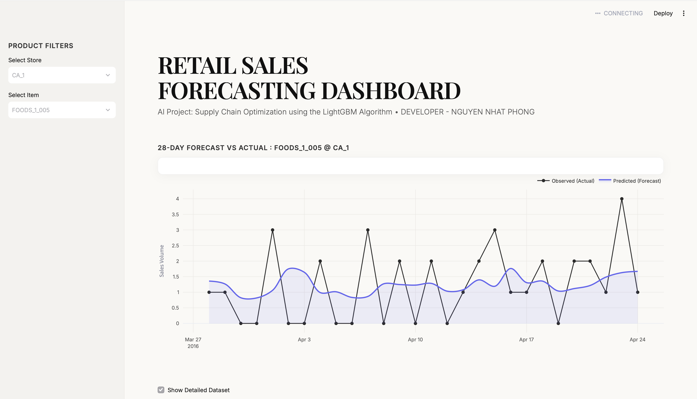

# Retail Sales Forecasting - M5 Walmart Data

Dự án Trí tuệ Nhân tạo (AI) ứng dụng thuật toán Machine Learning để tối ưu hóa chuỗi cung ứng và dự báo nhu cầu hàng hóa bán lẻ cấp độ sản phẩm, dựa trên tập dữ liệu lịch sử của Walmart (Kaggle M5 Forecasting).

**Phát triển bởi:** NGUYEN NHAT PHONG

## Mục tiêu dự án
Giải quyết bài toán **Intermittent Demand (Nhu cầu đứt quãng)** trong ngành bán lẻ. Đây là hiện tượng dữ liệu bán hàng có chứa lượng lớn giá trị 0 (vài ngày liên tiếp không bán được hàng) xen kẽ với các đỉnh doanh số bất ngờ. Các mô hình hồi quy (Regression) truyền thống thường thất bại ở bài toán này do xu hướng dự đoán cào bằng.

## 🛠️ Công nghệ & Thư viện sử dụng
*   **Xử lý dữ liệu quy mô lớn (Big Data):** `pandas`, `numpy`, `pyarrow` (định dạng Parquet).
*   **Mô hình hóa (Modeling):** `LightGBM` (Tối ưu hóa tốc độ và bộ nhớ).
*   **Tối ưu siêu tham số (Hyperparameter Tuning):** `Optuna`, `MLflow` (Theo dõi log thực nghiệm).
*   **Giải thích mô hình (Explainable AI):** `SHAP`.
*   **Triển khai giao diện (Deployment):** `Streamlit`, `Plotly`.

## Pipeline Kỹ thuật (Quy trình thực hiện)

### 1. Tối ưu hóa Bộ nhớ (Memory Optimization)
Xử lý tập dữ liệu thô lên tới gần 60 triệu dòng sau khi chuyển đổi cấu trúc (Melting). Áp dụng kỹ thuật **Downcasting** (ép kiểu dữ liệu xuống mức dung lượng thấp nhất có thể chứa giá trị) giúp giảm **80%** mức tiêu thụ RAM, đảm bảo toàn bộ quá trình huấn luyện có thể chạy mượt mà trên môi trường máy tính cá nhân (Kiến trúc Apple Silicon ARM).

### 2. Feature Engineering (Tạo đặc trưng)
Thiết kế các nhóm đặc trưng cốt lõi để giúp mô hình học được chu kỳ và xu hướng:
*   **Time-based:** Bóc tách ngày tháng, phân biệt ngày nghỉ cuối tuần (Seasonality).
*   **Lag Features:** Lấy độ trễ doanh số 7 ngày và 28 ngày trước đó.
*   **Rolling Statistics:** Tính trung bình trượt (Rolling Mean) để nắm bắt đà bán hàng dài hạn.

### 3. Huấn luyện Mô hình (Modeling)
Sử dụng **LightGBM** kết hợp với **Tweedie Distribution** làm hàm mục tiêu. Phân phối Tweedie là công cụ toán học tiêu chuẩn trong ngành bán lẻ, giúp thuật toán xử lý chính xác tập dữ liệu có độ lệch cao (chứa quá nhiều số 0) mà không làm mất đi các đỉnh dự báo.

### 4. Tối ưu tự động & Giải thích tính minh bạch
*   Sử dụng thuật toán tìm kiếm Bayesian của **Optuna** để tự động dò tìm cấu trúc cây (num_leaves) và độ phân tán (variance_power) tốt nhất.
*   Trích xuất **SHAP values** để minh bạch hóa hộp đen (White-box AI), cho phép trực quan hóa lý do tại sao mô hình đưa ra mức dự báo cụ thể dựa trên mức độ tác động của từng đặc trưng.

## Trải nghiệm Giao diện (Streamlit Dashboard)

Dự án đi kèm một Dashboard tương tác mang phong cách thiết kế tạp chí hiện đại (Editorial Design/Neumorphism), cho phép người dùng chọn từng cửa hàng và sản phẩm cụ thể để đối chiếu trực quan đường dự báo của AI với doanh số thực tế trong vòng 28 ngày.

**Cách chạy Dashboard trên máy cá nhân:**

1. Cài đặt các thư viện cần thiết:
```bash
pip install -r requirements.txt
```

2. Khởi chạy ứng dụng 
```bash
streamlit run app.py
```
## Truy cập hệ thống:
Giao diện: http://localhost:8501

<p align="center">
  
</p>
